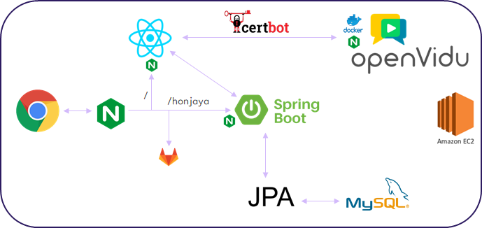
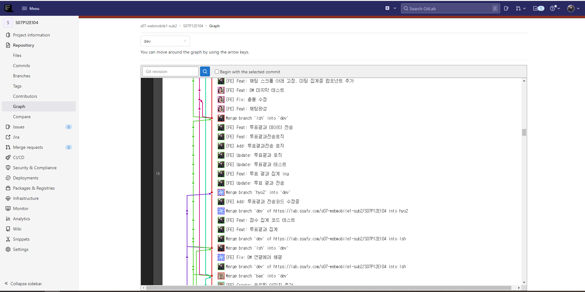
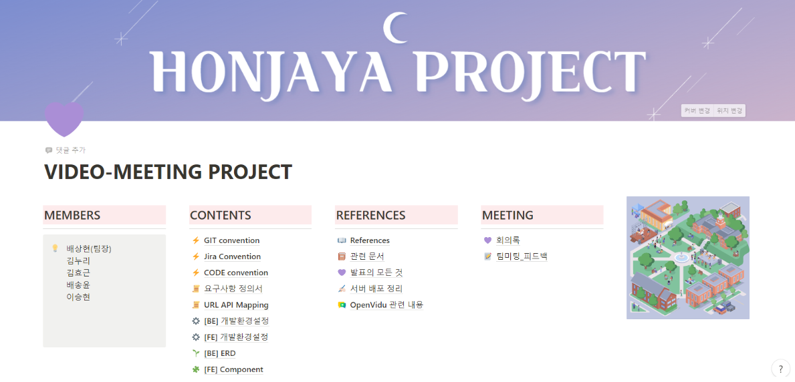
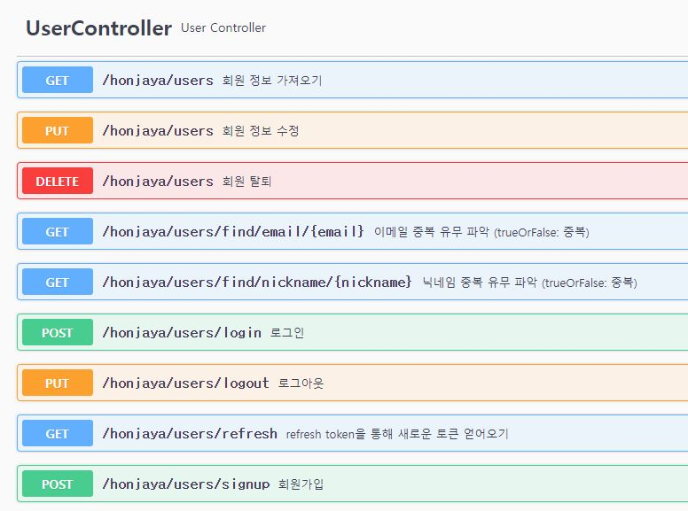
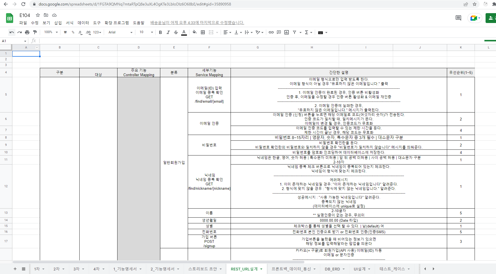
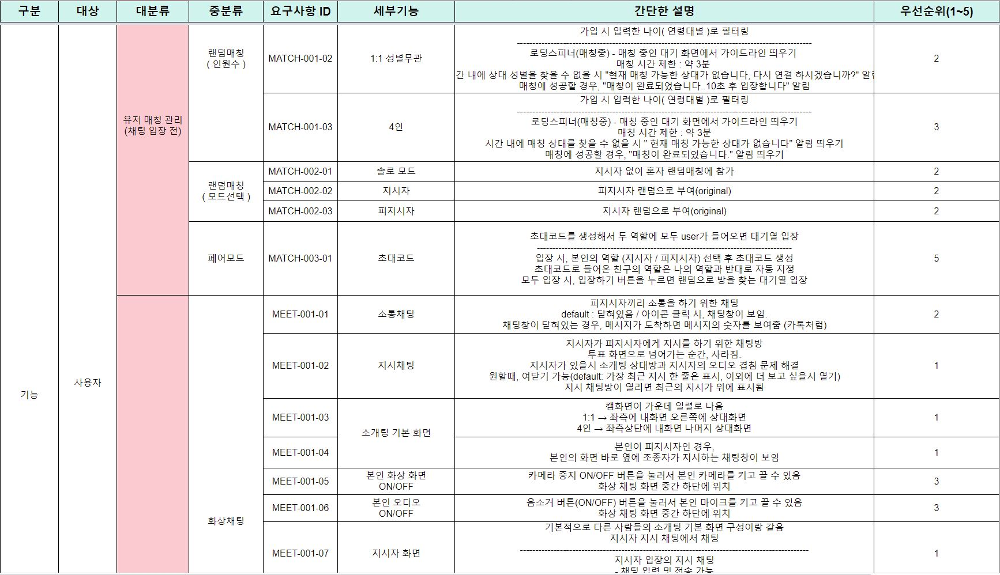
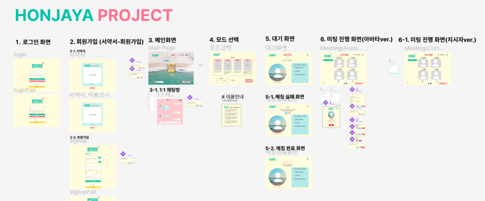
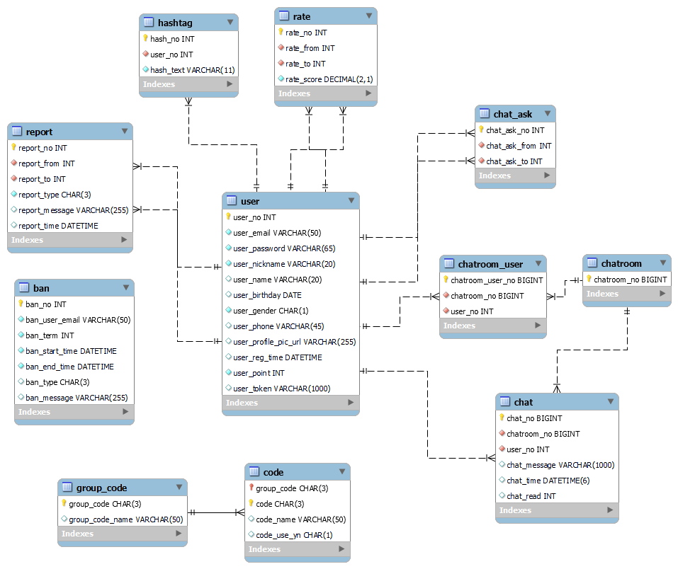

# 혼자야 ? (비대면 아바타 미팅 서비스)

#### :trophy: SSAFY 7기 공통 프로젝트 우수상 수상작 (부울경 1반 3등)

📆 **프로젝트 진행기간 : 2022/07/11 ~ 2022/08/19**

🤠 **FE: 김누리, 김효근, 배송윤, 이승현**

😼 **BE: 배상현 (팀장)**

📽 **[UCC 및 프로젝트 설명 유튜브 링크 (사용자 가이드)](https://youtu.be/ngQkkMlmzA8)**


## 👭 소개

### 세상에 없던 새로운 만남, 아바타 미팅 서비스 <혼자야?>

#### 	"**혼자야?**"는 랜덤 미팅 서비스와 게이미피케이션을 접목시켜 사용자들의 접근성을 높이고, 

#### **랜덤 대화 주체 추천**, **유저 상호 평가** 등의 유저 친화적 컨텐츠를 제공하는 스낵 서비스 입니다.


## 🔬주요 기능 

- Openvidu (webRTC)를 통한 비대면 랜덤 화상채팅(미팅) 서비스입니다.
- 예전 예능에서 유행했던 “아바타 소개팅”이라는 컨텐츠에서 아이디어를 얻어 지시자 역할인 유저가 명령을 내리고, 아바타 역할인 유저가 이를 수행하며 재밌는 상황이 연출되는 서비스입니다.
- 4가지 역할(싱글, 아바타, 지시자, 랜덤)과 미팅 정원(1:1 또는 4인)을 선택하여 입장할 수 있는 랜덤 매칭 시스템을 구현하였습니다.
- 유저는 상대 유저가 싱글 역할 유저인지, 아바타 역할 유저인지 모르는 상태로 대화를 진행하며, 대화 시간이 종료될 경우 상대의 역할을 맞히거나 자신의 역할을 속여서 포인트를 얻는 방식의 gamification이 적용되어 있습니다.
- 해당 미팅에서 마음에 든 상대와 상호 동의 하에 1:1 DM 채팅을 따로 할 수 있습니다.


## 🔎 혼자야? 서비스 화면

### 프로필 변경 및 해시태그 생성


---

### 모드선택 및 대기화면


#### - 대기시간(30초) 초과시 재매칭 


---

### 미팅진행화면


---

### 투표진행화면


---

### 투표종료화면 (지시자, 득점 순위 공개)


---

### 1:1 DM 채팅


---

### 회원가입 및 이메일 인증


---

### 회원정보수정


## 🧰개발 환경

### ⌨ Backend 

- SpringBoot 2.7.1
- Java 1.8
- Type: Gradle
- Packiging: jar
- STS 3.9.13 e4.16.0 (IDE)
- MySQL Workbench: 8.0.28
- JPA
- Websocket (5.3.18) + STOMP
- JWT
- Lombok
- 그 외 버전 및 설정: `/backend/build.gradle`  파일 참조


### 🖥 Frontend

- VSCode (IDE)
- React 17.0.2
- redux 4.2.0
- redux-toolkit 1.8.3
- Node.js 16.16.0 
- styled-components 5.3.5
- yarn 1.22.19
- VSCode Extension
  - Prettier - Code formatter (Ver 9.5)
  - ES Lint (Ver 2.2.6)
  - Reactjs code snippets (Ver 2.4.0)
  
  

### :video_camera: Web RTC

- openvidu 2.22.0


### 🔗CI/CD

- Amazon EC2 - Ubuntu 20.04
- Nginx - 1.18.0
- docker - 20.10.17


## 🧩서비스 아키텍처




## 🌈기술 특이점

- 어떤 기술을 어떤 기능에 적재적소로 사용할지 고민하였습니다.

- **랜덤으로 미팅을 매칭 시켜주는 로직**은 전체 유저들을 관리해야 하므로 **백엔드 서버의 비동기 처리**(DeferredResult)를 사용했으며, **미팅 안에서 진행되는 로직**은 각 개별 미팅 안에서 이뤄지므로 **Openvidu**를 활용하여 **프론트의 소켓통신**으로 해결하였습니다.

- 저장할 필요가 없는 화상 미팅 안의 채팅은 openVidu의 기능을 활용한 반면에, 채팅 메시지들을 DB에 저장해야 하는 1:1 DM 채팅 기능은 STOMP 방식을 통해 백엔드 서버에서 처리하도록 구현하였습니다.

- [백엔드 설계 및 구현 설명 README](backend/README.md)

  

## 🤝🏻협업 툴

- Gitlab

  
  
- Jira

  
  
- Notion

  
  
- Figma

- Swagger

  

- Webex

- Google Sheet

  


## 📋요구사항 정의서




## 💡와이프레임 및 스토리보드




## ⚙컨벤션

### - Git 컨벤션

---

```
* Code 관련
    - Add : 코드나 문자 추가
    - Test : 테스트 코드 삽입
    - Update : Fix와 달리 원래 정상적으로 동작한 기능의 보완 개념
    - Fix : 버그 수정
    - Remove : 코드 삭제
    - Refactor : 결과의 변경 없이 코드 구조 재조정
    - Move : 코드나 파일의 이동
    - Correct : 문법 오류, 타입 및 변수 이름 변경 등 수정 사항에 사용
    
* 기능 관련
    - Feat : 새로운 기능 추가
    - Chore : 기타 작업, 빌드 작업, 패키지 관리자 구성 등 업데이트, Production Code 변경 없음
    - Test : git 관련 테스트 혹은 코드 관련 테스트 진행
    
* 파일, 폴더 관련
    - Docs : 문서 변경 (문서 추가, 이름 변경 등)
    - Move : 코드나 파일의 이동
    - Rename : 이름 변경
    - Create : 파일이나 폴더 추가
```

```
* 커밋 작성
	- Form 
		[Position: Jira issue number] Type: message

	- Example
		Type 첫 글자는 대문자
		message는 50자 내로 작성
		[FE: S07P12E104-12] Feat: 로그인 기능 구현
```


### - Code 컨벤션

---

- Front-End
  - HTML, CSS
    - 변수, 함수, 인스턴스 : kebab-case
    - Indent : 2칸 스페이스바가 원칙 
  - JavaScript
    - 변수, 함수, 인스턴스 : camelCase
    - Indent : 2칸 스페이스바가 원칙
    - 상수는 대문자 SNAKE_CASE를 사용

- Back-End
  - Java
    - 변수, 메소드(함수) : camelCase
    - 클래스 : PascalCase
    - Indent : 4칸 Tab 들여쓰기
    - 중괄호의 시작 부분(”{”)은 라인의 오른쪽에 씀
    - 짧은 주석은 라인의 오른쪽, 긴 주석은 무언가가 나올 차례임을 나타낼 때 라인의 위쪽, 부연 설명일 때 라인의 아래쪽에 씀
    - if문, for문 등에서 한 줄만 있을 경우에도 중괄호로 블록 처리한다.
  - DB (JPA)
    - Database(스키마)명 : honjaya_db
    - Table명은 기본적으로 명사 또는 동사 한 단어로 표현한다.
    - N:M 관계를 저장하기 위한 매핑 테이블의 경우, “테이블1_테이블2”의 형태로 표현한다.
    - Column명: “테이블_속성” (테이블 이름이 길 경우 약어 사용)
    - 참조형일 경우 참조하는 테이블 이름을 따른다. (경우에 따라서 예외 허용 (직관적으로))


### - Jira 컨벤션

---

일정, 업무 관리 등 효율적인 협업을 위해 Jira를 활용하였습니다. 
매주 월요일, 데일리 스크럼을 통해 한 주 동안 진행 해야 할 업무를 분류하고, 일주일 단위의 스프린트를 진행 하였습니다. 

- Epic : 최상위 기능을 대제목과 소제목을 분류하여 Epic 작성
- Story : Epic의 하위 기능에 FE, BE 별로 구분하여 Story 작성
- Subtask : 각 기능을 구현하기 위한 개발 내역은 Subtask에 작성


## ✍Notion 

- 공유: 개발을 하며 참고할 수 있는 레퍼런스, 사이트 링크 등을 모아 팀원들과 공유
- 협업: 협업개발에 필요한 컨벤션, 프로젝트 일정 등 정리 
- 기록: 회의록, 팀미팅 피드백 등을 기록하며 프로젝트를 진행 


## 🖇ERD




## 🚀배포 및 EC2 설정 관련

[[FE] 배포 및 openVidu ReadMe](참고자료/[FE] 배포 및 openVidu.md)

[[FE] 빌드 후 배포](참고자료/[FE] 빌드 후 배포.md)

[[FE] nginx 수동 배포(프로젝트 진행 당시)](참고자료/[FE] nginx 수동 배포.md)

[[FE] OpenVidu (프로젝트 진행 당시)](참고자료/OpenVidu 관련 내용.md)

[[BE] EC2 MySql 연결](참고자료/[BE] EC2 mySQL 연결.md)

[[BE] 배포](참고자료/[BE] 배포.md)

