# 백엔드 설계 및 구현 README

## 1. DB 및 JPA 설계

- 먼저 ERD로 DB를 설계한 후에 JPA의 Entity를 매핑하는 방식으로 작업함
- 양방향 참조는 영속성 컨텍스트와 데이터베이스의 상태를 일치시키는 작업이 까다로운 단점이 있으므로, 본 프로젝트에서는 단방향 참조로 설계함
- N:1 관계는 @ManyToOne으로 단방향 관계로 구현함

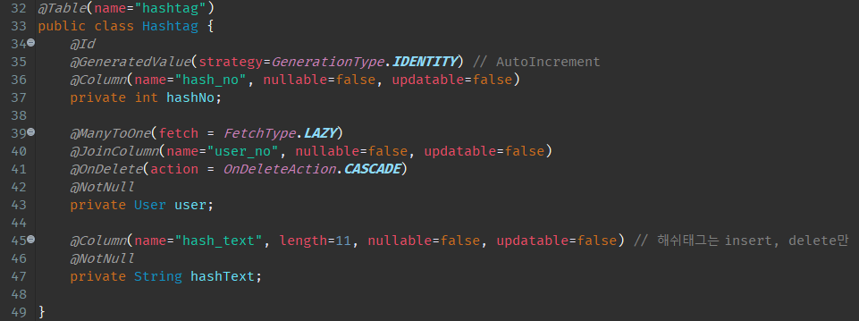

- M:N 관계는 매핑 테이블(엔티티)을 따로 추가한 후에 @ManyToOne으로 단방향 관계로 구현함

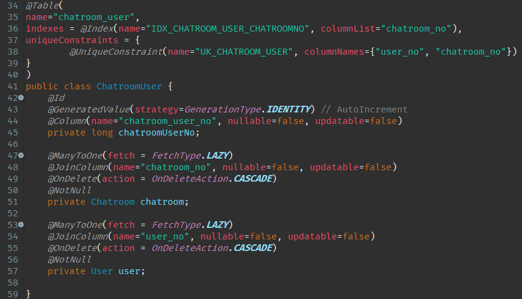

- 테이블의 컬럼을 상세 설정해야 하는 경우 columnDefinition을 사용함

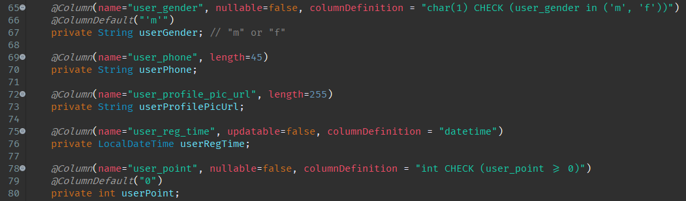

- Repository에서 복잡한 쿼리를 직접 생성해야 하는 경우에는 @Query를 사용함

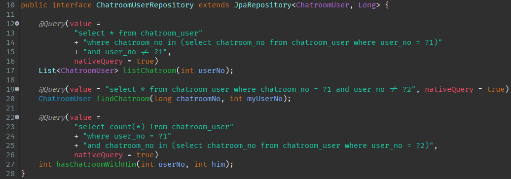

## 2. Controller 설계

- StompChatController를 제외한 모든 컨트롤러는 @RestController로 설계함
- 로그인할 때 JWT(JSON Web Token) 방식으로 발급 받은 "access-token"을 로그인이 필요한 서비스의 모든 요청에 헤더로 받아서 토큰이 유효한지 검사함
- 유효한 토큰일 경우 "access-token"의 payload에서 요청을 보낸 사용자의 userNo 값을 추출하여 사용하고, 유효하지 않은 토큰일 경우 401 에러 코드를 헤더로 반환한 후 프론트에서 "refresh-token"을 보내 "access-token"을 재발급 받음
- Request용 DTO와 Response용 DTO를 따로 설계하여 DB 설계에 대한 노출을 최소화하고, Swagger로 협업 시 프론트에서 어떤 데이터를 주고 받는지 확실하게 알 수 있도록 함

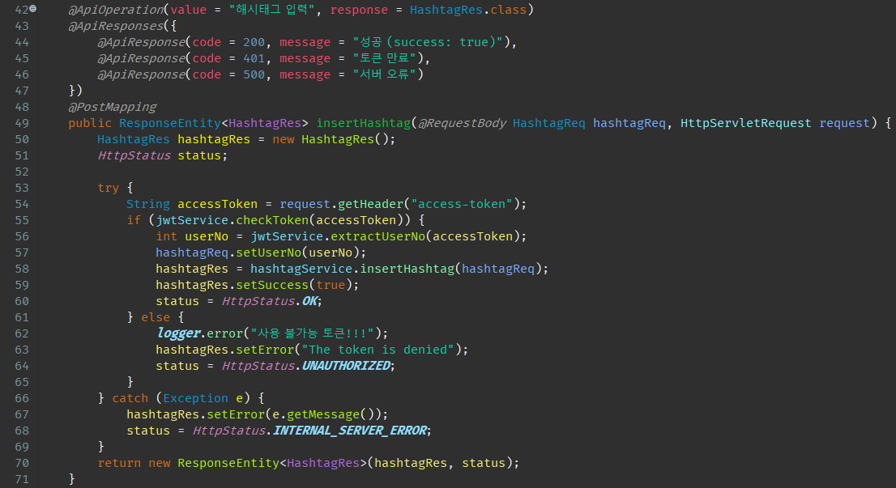

## 3. 랜덤 매칭 시스템 구현

- DeferredResult를 이용하여 long polling 방식의 비동기 처리로 구현함
- 유저가 대기 중일 때, 다른 유저가 대기 중 취소했을 때 등과 각 유저의 역할을 달리했을 때 등 경우의 수를 조합하여 80 가지의 테스트 케이스를 검증함

#### 입장 시

- 유저는 2인용 or 4인용을 선택하고, 싱글 or 아바타 or 지시자 or 랜덤 역할을 선택할 수 있음
- 2인용 대기 큐와 4인용 대기 큐를 각각 LinkedHashMap으로 구현하여 관리함

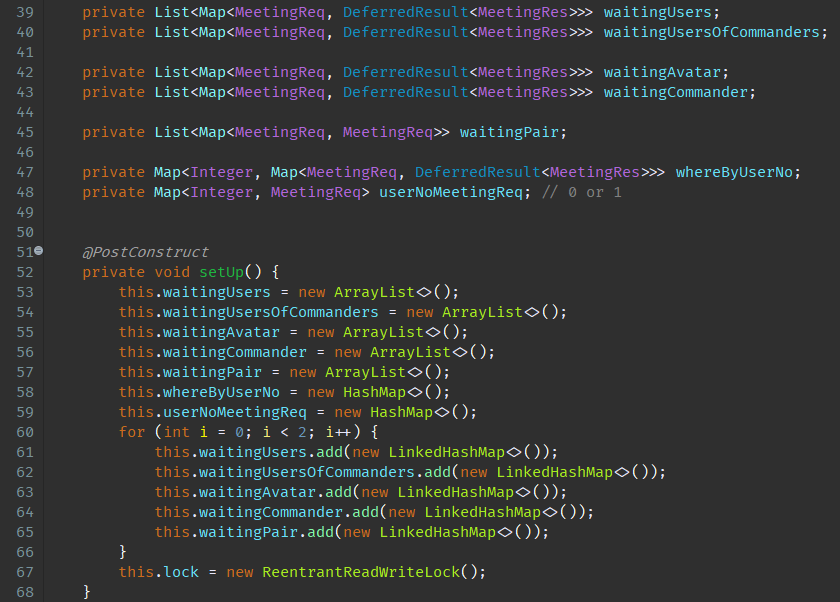

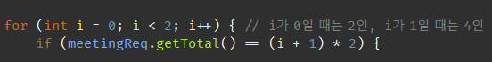

- 같은 아이디로 중복 요청일 경우 기존 요청을 cancel로 처리

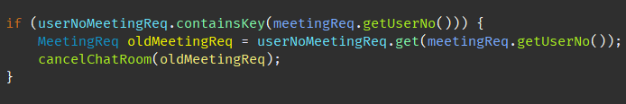

- 역할을 랜덤으로 설정하면, 페어를 찾는 중인 아바타(waitingAvatar)가 있을 경우 지시자로, 페어를 찾는 중인 지시자(waitingCommander)가 있을 경우 아바타로, 둘 다 없을 경우 싱글로 배정됨

- 싱글은 바로 LinkedHashMap으로 구현된 대기 큐(waitingUsers)에 들어감
- whereByUserNo는 현재 유저가 어떤 큐에 대기 중인지를 저장하는 HashMap이고, userNoMeetingReq는 유저 번호로 request 객체를 얻을 수 있는 HashMap임

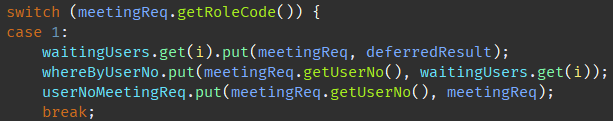

- 아바타는 페어를 찾는 중인 지시자가 존재할 경우 waitingUsers에 들어가고, 그 지시자는 waitingUsersOfCommanders에 들어감
- 서로가 페어라는 정보를 나타내기 위해 waitingPair에 서로의 정보를 key:value 쌍으로 저장함
- 페어를 찾는 중인 지시자가 없을 경우 waitingAvatar에 들어가서 지시자 페어가 나타날 때까지 대기함

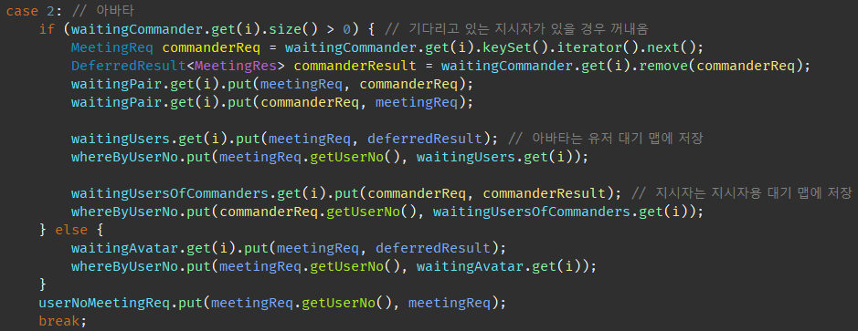

- 지시자는 페어를 찾는 중인 아바타가 존재할 경우 waitingUsersOfCommanders에 들어가고, 그 아바타는 waitingUsers에 들어감
- 서로가 페어라는 정보를 나타내기 위해 waitingPair에 서로의 정보를 key:value 쌍으로 저장함
- 페어를 찾는 중인 아바타가 없을 경우 waitingCommander에 들어가서 아바타 페어가 나타날 때까지 대기함

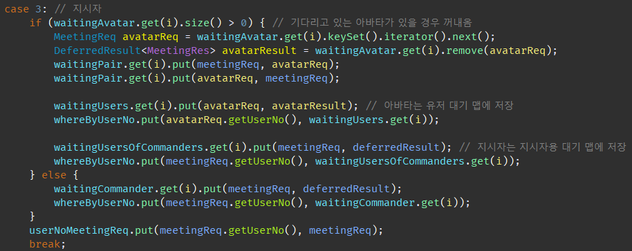

#### 대기 중 방 생성 요건이 충족됐을 시

- waitingUsers의 2인용 큐와 4인용 큐에 각각의 인원이 충족되면 방 생성이 시작됨

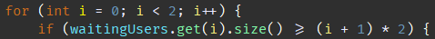

- waitingUsers에 들어간 순서대로 빠져나오며, 싱글 역할일 경우 바로 빠져 나옴

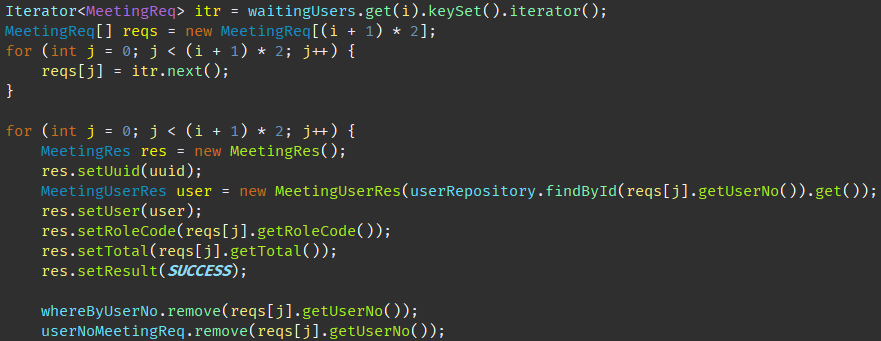

- 아바타 역할일 경우 페어로 설정된 지시자도 함께 빠져 나옴

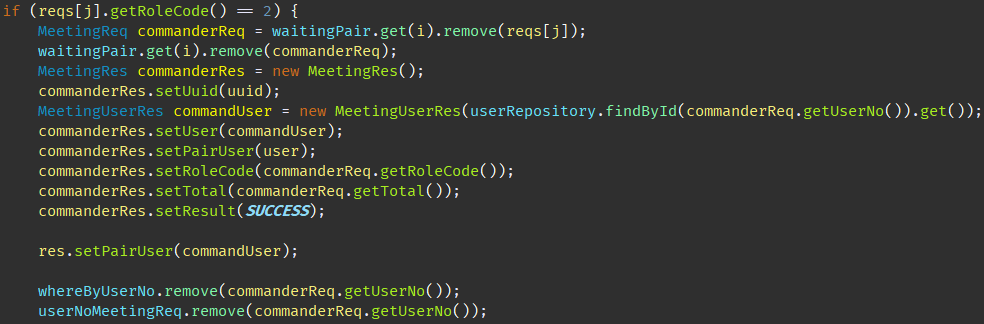

- DeferredResult의 setResult 메소드를 사용하여 응답을 보냄

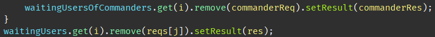

#### 매칭을 취소하거나 timeout 됐을 시

- 취소하거나 timeout 됐을 시 큐를 원상 복구 시키는 메소드 cancelAndMakeResult를 호출한 후, DeferredResult의 setResult 메소드를 사용하여 응답을 보냄

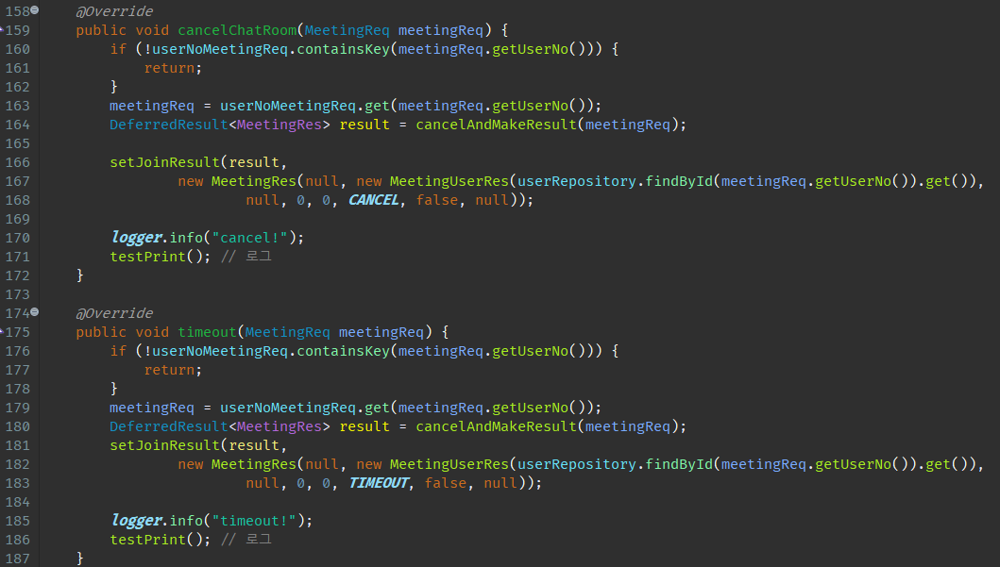

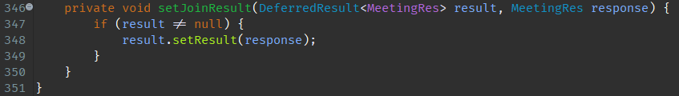

- whereByUserNo로 객체가 있는 큐에서 해당 request 객체를 제거함 (싱글, 페어 없는 아바타, 페어 없는 지시자는 여기서 끝)

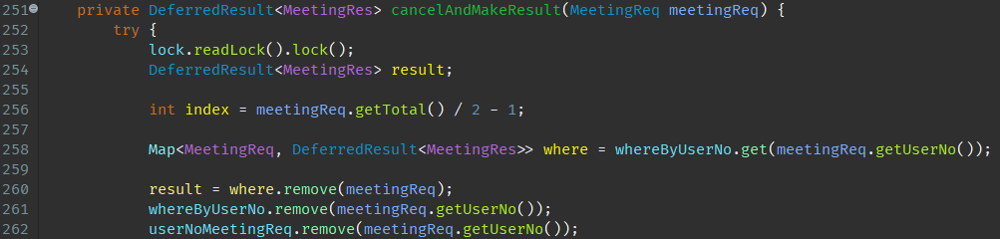

- 페어가 있는 유저가 취소했을 경우, 기존에 페어였던 지시자 또는 아바타는 다시 페어를 찾는 큐로 돌아가거나, 다른 유저와 페어가 됨

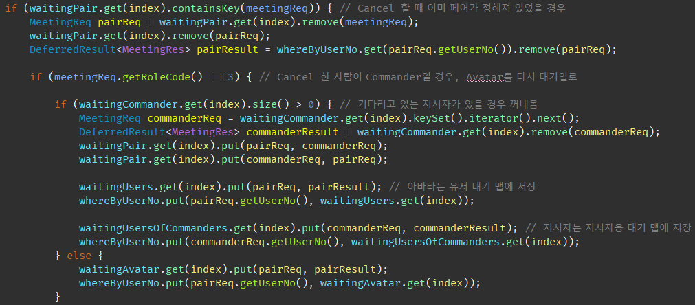

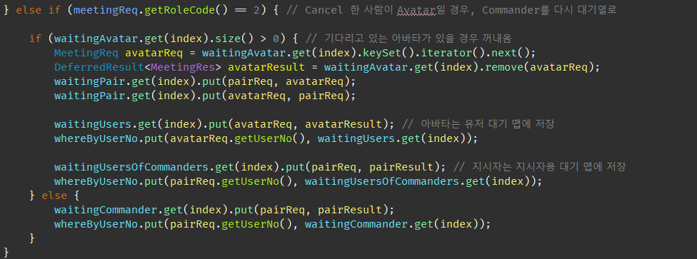

## 4. 1:1 DM 채팅 구현

- 1:1 DM 채팅에는 웹소켓을 통해 정해진 프로토콜로 메시지 통신을 할 수 있게 해주는 STOMP를 이용함
- 채팅창을 열면 기존에 했던 대화 내역들이 DB에서 불러와짐
- 채팅을 입력하면 웹소켓으로 데이터를 전달함과 동시에 DB에 채팅을 저장함
