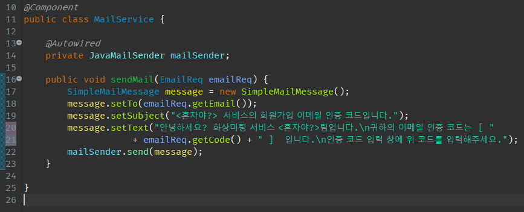

### 구글 SMTP를 이용한 메일 인증 서비스 구현 

----------

#### 1. application.properties 설정

application.properties에 **Gmail SMTP Server** 설정에 필요한 값들을 추가

```java
spring.mail.host=smtp.gmail.com
spring.mail.port=587
spring.mail.username=<내 구글 계정>
spring.mail.password=<내 구글 계정 패스워드>
spring.mail.properties.mail.smtp.auth=true
spring.mail.properties.mail.smtp.starttls.enable=true
```

`주의사항`

application.properties 파일은 .gitignore에 추가해서 계정 공개를 막아야함


#### 2. 메일 작성을 위한 View, Controller, Dto 생성


#### 3. JavaMailSender와 SimpleMailMessage를 이용한 메일 발송


- Mail Server의 속성

  - **MailSenderinterface**

    간단한 전자 메일을 보낼 수 있는 기본 기능을 제공하는 최상위 인터페이스

  - **JavaMailSenderinterface**
    위의 MailSender의 하위 인터페이스.
    MIME 메시지를 지원하며 대부분 MIMEMessage와 함께 사용.
    MimeMessage를 만들기 위한 도우미 클래스

  - **JavaMailSenderImplclass**
    JavaMailSender 인터페이스의 구현을 제공

    MimeMessage 및 SimpleMailMessage를 지원

  - **SimpleMailMessageclass**

    발신인, 수신인, 참조인, 제목 및 텍스트 필드를 포함한 간단한 메일 메시지를 작성하는 데 사용

  - **MimeMessagePreparatorinterface**

    MIME 메시지를 준비하기 위한 콜백 인터페이스를 제공

  - **MimeMessageHelperclass**MIME 메시지를 만들기 위한 클래스
    HTML 레이아웃에서 이미지, 일반적인 메일 첨부 파일 및 텍스트 내용을 지원

    - MIME이란?

      >Multipurpose Internet Mail Extensions의 약자이다.
      >기존 UUEncoding 방식은 ASCII(텍스트) 파일만 지원하여 음악, 워드 파일 등의 바이너리 파일을 전송할 수 없음
      >이러한 방식을 보안하여 나온 인코딩 방식이다.


#### 4. 앱 비밀번호를 통한 로그인 설정

부여받은 앱 비밀번호를 **application.properties**에 **spring.mail.password**에 기입하면 된다.


참고 링크 : https://born2bedeveloper.tistory.com/14

