# 비대면 아바타 화상 미팅 서비스 혼자야

### 🎞 시연 시나리오

#### 회원가입 및 로그인

1. 회원가입 시 서약서 동의

   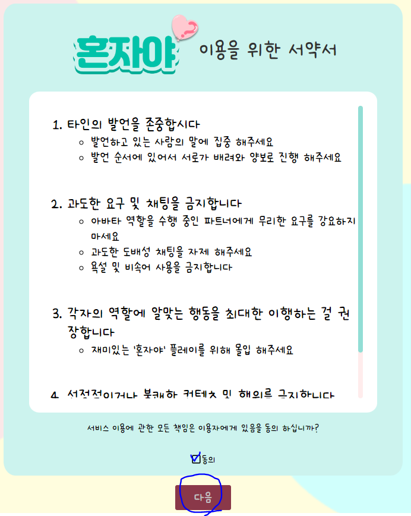

2. 무분별한 계정 생성 방지 및 보안을 위한 구글 활용 smtp 이메일 인증 서비스

   

   

3. 로그인

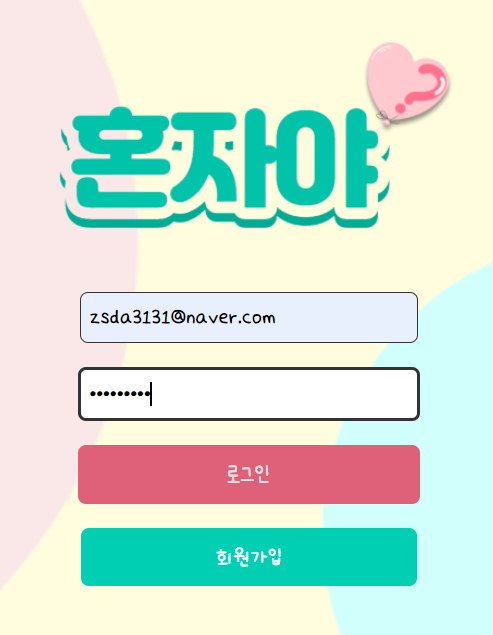

#### 메인화면

1. 도움말 및 이용 가이드

   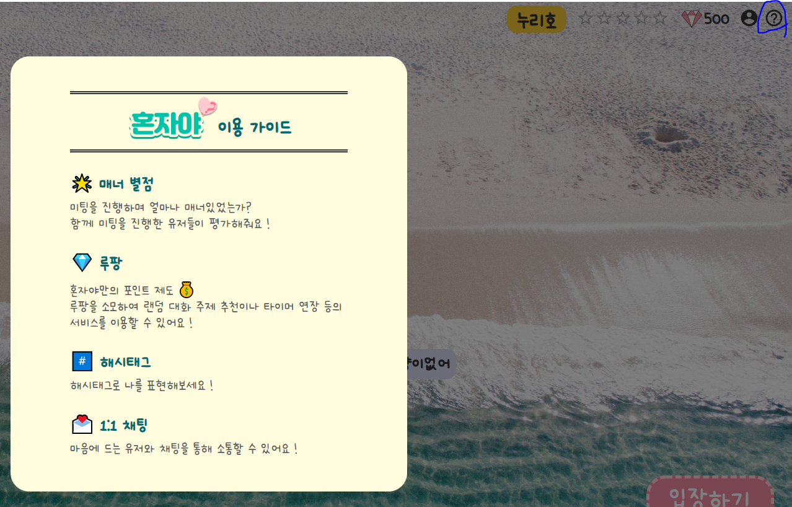

2. 프로필 캐릭터 변경

   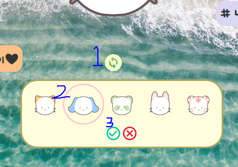

3. `1:1` Direct Message 목록 확인

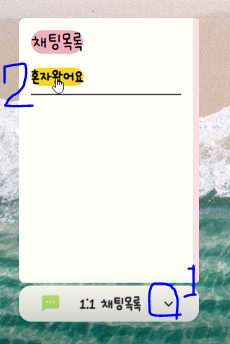

#### 미팅 진행 화면

1. 역할 선택 하기 - 캐릭터 자체 제작 강조

2. 대기화면 - 카메라 버튼 클릭 시 대기중일 때 캠을 켜서 사용 가능

   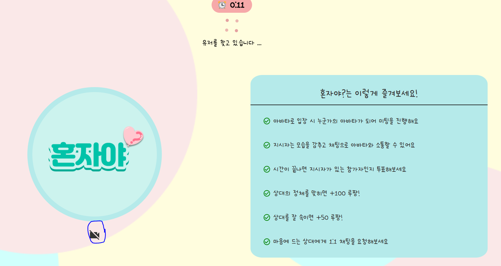

3. 미팅 진행 화면 입장

   

   - 미팅 화면 내의 기능 시연

     1. 시간연장 버튼을 눌러서 포인트를 소모하여 시간 연장을 진행 할 수 있다.

     2. 랜덤주제 뽑기 버튼을 눌러서 랜덤 주제를 변경할 수 있다.

     3. 바로 투표 버튼을 눌러서 누가 지시자가있는 아바타인지, 일반 참가자인지 정체를 맞히는 투표화면으로 바로 넘어갈 수 있다.

     4. 채팅창에서 나의 역할을 한번더 알려주고, 아바타와 솔로는 전체 채팅이 가능하다.

     5. 지시자가 있을경우 지시자의 채팅은 아바타에게만 보여진다.

        EX) 지시자 채팅 예시

        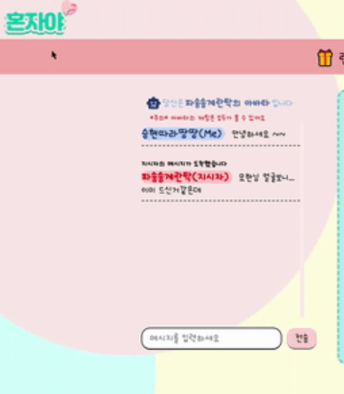

4. 투표화면 - 투표 대상자의 캠을 클릭하면 투표가 가능하다

   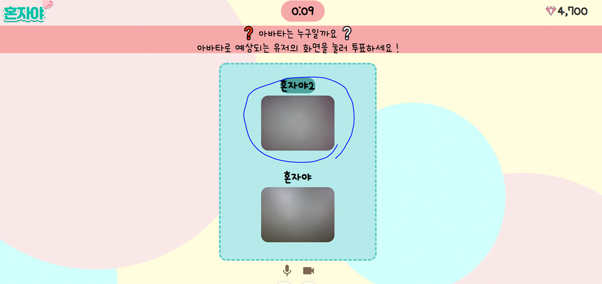

5. 결과화면

   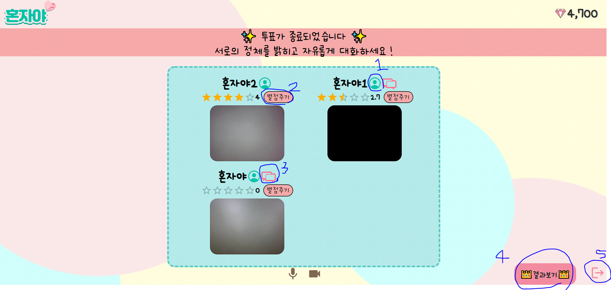

   - 결과 화면 내의 기능

     1. 상대의 프로필 아이콘을 누르면 프로필 정보를 확인할 수 있다. (추가로 신고 아이콘을 누르면 악성 유저 신고도 가능하다)

        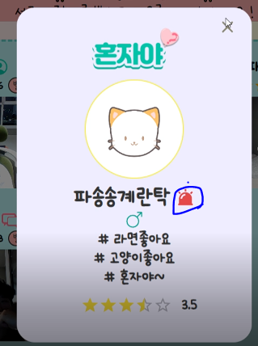

        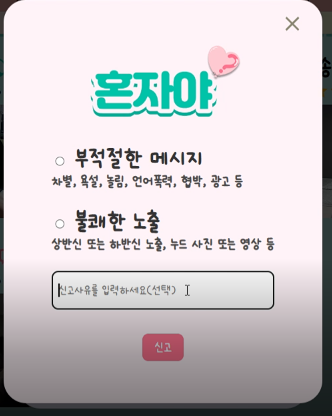

        

        

     2. 별점주기 버튼을 통해 상대에게 매너별점을 부여할 수 있다.

     3. 메시지 모양 아이콘을 통해 상대에게 1:1 채팅 요청을 보낼 수 있다.

     4. 결과보기 창에 마우스를 호버하면 상대를 맞추거나, 상대를 속였을 때 얻게 되는 포인트와 , 그에 따른 순위를 볼 수 있다.

        

        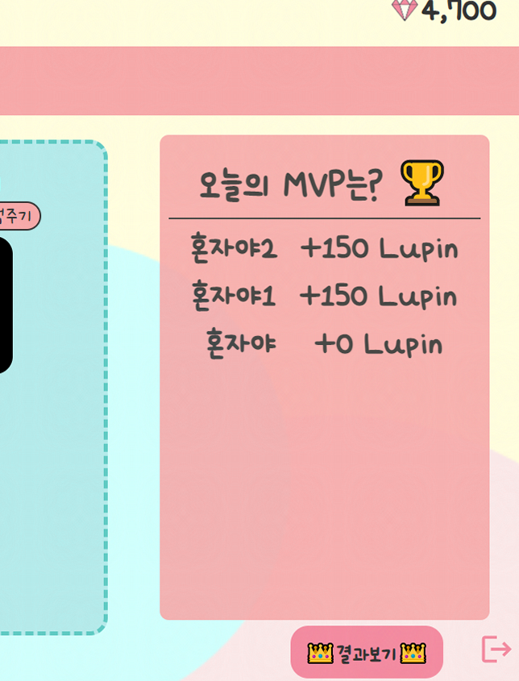

     5. 나가기 버튼을 이용해 메인 화면으로 나갈 수 있다.

        

        

     ### 메인화면에서 DM 신청 목록 열어보기

     1. 방금 미팅이 끝나고 따끈하게 생성된 채팅 목록에서 채팅을 진행할 수 있다.
     
        

        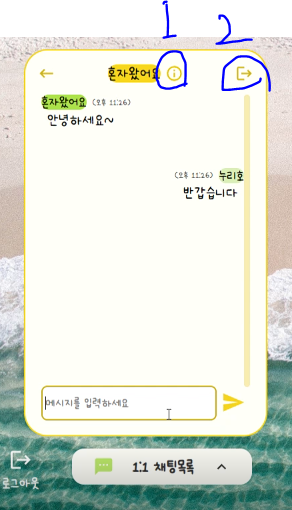
        
        
        
        - 채팅 내부 기능
          1. 유저 닉네임 옆의 아이콘을 누르면 프로필 정보를 여기서도 확인할 수 있다.
          2. 나가기 버튼을 누르면 채팅방 삭제가 가능하다
     
     

​	
