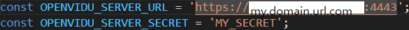
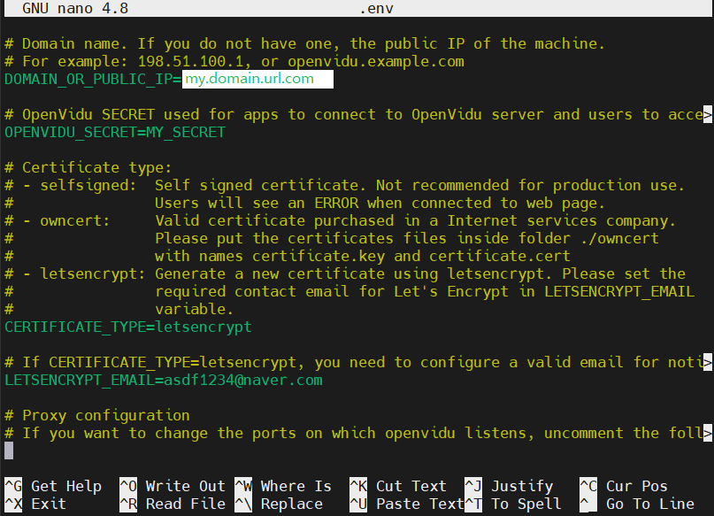
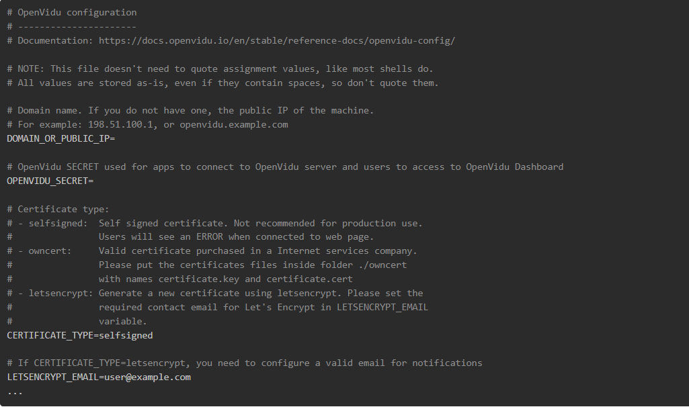

# OpenVidu 관련 내용

> On Promises 형태로 진행하기에는 app과 openvidu를 연결할 방법을 모르기 때문에,
일단은 화면 개발을 위해 튜토리얼 openvidu 서버를 구동하고 해당 서버를 통해서 화면 구성을 진행할 계획이다.

## EC2에 docker를 통한 `튜토리얼 openvidu 서버` 실행하기

> 주로 서버 컨테이너가 구동중이겠지만, 그래도 혹시
> 

### 튜토리얼 서버 구동하기

- 서버 컨테이너의 구동 확인 방법
    1. MobaXterm을 키고 ubuntu계정으로 cli 화면을 띄운다.
    2. sudo docker ps 라는 명령어를 통해 현재 구동중인 컨테이너 목록을 가져올 수 있다.
    3. openvidu/openvidu-server-kms:2.22.0이라는 이미지를 가지고 구동중인 컨테이너가 있다면, 튜토리얼 openvidu 서버는 실행되고 있다.
    
- 튜토리얼 서버가 구동되지 않고 있는 경우
  
    ```bash
    sudo docker run -p 4443:4443 --rm -e OPENVIDU_SECRET=MY_SECRET -e DOMAIN_OR_PUBLIC_IP=my.domain.url.com openvidu/openvidu-server-kms:2.22.0
    ```
    
    해당 코드를 그대로 치면 튜토리얼 서버가 구동 가능하다.
    
    - 도커 명령어
        - -p : 포트포워딩으로 
        <외부에서 접속하는 포트> : <도커 컨테이너 내부에서 수신받을 포트>
        를 정해주는 명령어다.
        - —rm : 해당 컨테이너가 정지(stop명령어)된다면, 자동으로 컨테이너 자체가 사라지게 만들기(kill명령어 효과와 동일하게) 위해 1회용으로 컨테이너를 사용하겠다는 명령어이다.
        - -e : 컨테이너에 돌아가는 프로그램의 환경변수를 설정해주는 명령어이다.
          
            
            
            해당 사진을 보면 알겠지만, on promises 형태로 사용할 때 필수적으로 설정해야 하는 환경 변수들이 있는데, 그 값을 docker를 실행할 때 같이 넣어줄 수 있다.
            
            환경 변수가 나온 김에, certificate_type은 letsencrypt로 변경해주고, letsencrypt_email은 이메일 형태의 아무 값이나 넣어도 되는 듯 하다. 그래서 나는 asdf1234@naver.com을 입력 해 놓았다.
            
            
            
            openvidu_secret 변수 값은 프론트와 소통할 때 인증키와 같은 것이므로 프론트와 같은 값으로 설정 해주어야 한다.
            

### Frontend와 Openvidu 연결하기

> tutorial-insecure-react 파일을 토대로 개발할 예정
> 

`On promises 형태가 아니기 때문에 프론트 서버를 구동해야한다`

```jsx
const OPENVIDU_SERVER_URL = 'https://my.domain.url.com:4443'; 
														//'https://' + location.hostname + ':4443';
```

App.js 파일에 최상단에 보면, Frontend에서 영상 연결을 위해 openvidu 서버와 연결할 주소를 가지고 있는데, 처음에는 local에서만 튜토리얼을 진행할 것을 예상하여 주석 처리 된 값이 적혀있다.

위 튜토리얼 서버를 연결할 당시, 포트포워딩이 4443:4443으로 구성되어있으므로, 오픈비두 서버와 연결하려면 4443 포트를 사용해야만 한다.

또한 도메인은 튜토리얼 서버를 실행시킨 ec2서버의 도메인을 작성해야 한다.

## On Promises 형태로 openvidu 사용하기

<aside>
💡 on promises 형태의 openvidu는 22.07.28 현재 ec2서버에 설치되어있고,
위치는 /opt 아래에 설치되어있다.

</aside>

<aside>
💡 22.07.28 현재 openvidu가 제공하는 프론트 도커 이미지(/opt/openvidu/docker-compose.override.yml)가 존재하며, 프론트를 완성할 시 이 파일을 지우고 만든 프론트를 연결시켜 주는 방법을 찾아야만 한다.
참고 문헌 : [https://docs.openvidu.io/en/stable/deployment/deploying-openvidu-apps/](https://docs.openvidu.io/en/stable/deployment/deploying-openvidu-apps/)

</aside>

### OpenVidu(ver.CE) 설치

> 참고 문헌 : [https://docs.openvidu.io/en/stable/deployment/ce/on-premises/](https://docs.openvidu.io/en/stable/deployment/ce/on-premises/)
> 
1. Docker와 Docker Compose가 미리 설치되어 있어야 한다.
2. 아래 포트들이 열려있어야 한다.
   포트를 여는 명령어 : sudo ufw allow portnum
   연속된 포트를 여는 명령어 : sudo ufw allow portn1:portn2/tcp 또는 udp
   
    - **22 TCP**: to connect using SSH to admin OpenVidu.
    - **80 TCP**: if you select Let's Encrypt to generate an SSL certificate this port is used by the generation process.
    - **443 TCP**: OpenVidu server and application are published by default in standard https port.
    - **3478 TCP+UDP**: used by STUN/TURN server to resolve clients IPs.
    - **40000 - 57000 TCP+UDP**: used by Kurento Media Server to establish media connections.
    - **57001 - 65535 TCP+UDP**: used by TURN server to establish relayed media connections.
3. 추가로 nginx가 openvidu를 설치하기 이전에 깔려있으면 안된다고 한다.
4. openvidu를 설치하는 장소는 /opt 위치이다.
5. 설치를 하기 위해서는 관리자 권한인 상태에서 설치해야하므로
관리자 모드로 들어가기 위해 sudo su를 명령한다.
참고로 관리자 모드 나오기는 exit을 치면 된다.
6. opt파일 안에서 
curl [https://s3-eu-west-1.amazonaws.com/aws.openvidu.io/install_openvidu_latest.sh](https://s3-eu-west-1.amazonaws.com/aws.openvidu.io/install_openvidu_latest.sh) | bash
명령어를 치면 openvidu가 설치가 된다.
7. 설치가 완료되었다면, `/opt/openvidu 폴더로 들어간 다음`, openvidu를 실행하거나 환경 파일을 설정할 수 있다.
    1. 실행 명령어 : sudo ./openvidu start
    2. 환경 변수 설정하기
        1. sudo su
        2. nano .env
        3. 환경 변수에 입력 후 MobaXterm 하단에 보면 커맨드 목록이 있는데,
        Ctrl+o를 하면 저장이 될 것이다.
        4. 저장 커맨드를 하면 엔터를 한번 쳐주면 .env 이름으로 저장이 된다.
        5. Ctrl+x를 통해 환경 변수 파일을 나올 수 있다.
    
    
    

### OpenVidu(on promise.ver) 실행

> ./openvidu start
./openvidu stop
./openvidu restart
> 

/opt/openvidu/ 안에서 openvidu를 실행하게 되면,

도커에는 5개의 이미지 파일이 컨테이너로 실행된다.

- Creating openvidu-docker-compose_coturn_1          ... done
- Creating openvidu-docker-compose_app_1             ... done
- Creating openvidu-docker-compose_kms_1             ... done
- Creating openvidu-docker-compose_nginx_1           ... done
- Creating openvidu-docker-compose_openvidu-server_1 ... done

문서에는 redis까지 실행되던데 현재에는 5개만 실행이 된다.

5개 중 app_1이라는 컨테이너는 앞으로 프론트를 완성시킨 다음 교체해주어야 할 이미지 파일이다.

지금은 app_1파일이 존재하므로, 프론트 서버를 실행시키지 않아도 접속 가능하다.

my.domain.url.com로 접속하면, openvidu에서 마련한 홈페이지가 뜰 것이다.