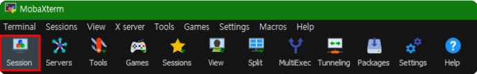
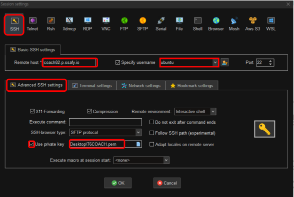
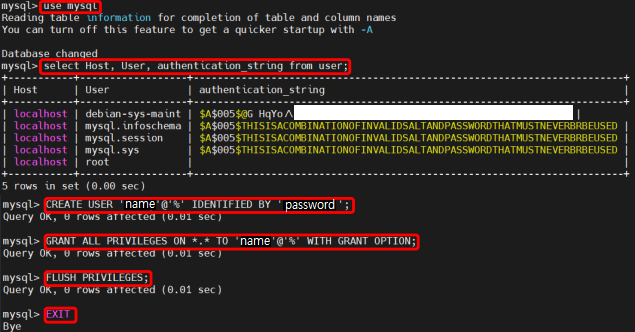
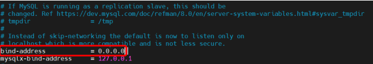
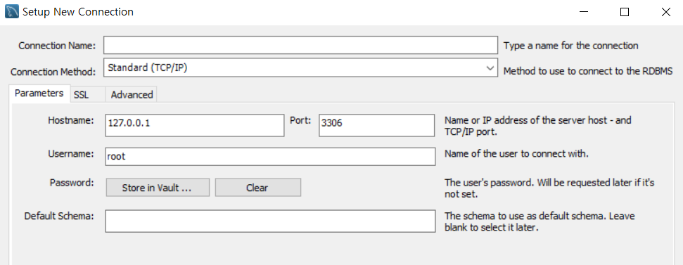
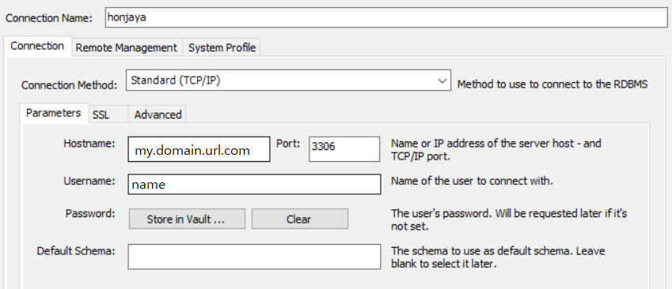

# EC2 mySQL 연결

## MobaXterm 사용

> MobaXterm 다운로드 페이지
>
> [MobaXterm Xserver with SSH, telnet, RDP, VNC and X11 - Download (mobatek.net)](https://mobaxterm.mobatek.net/download.html)

Putty + WinSCP 기능을 통합하여 제공하고 사이드에 GUI를 제공함

## EC2 접속

1. Session 생성

   

   

   - SSH 클릭 후 빨간색으로 테두리 된 설정을 입력해준다.
   - HOST는 사용할 도메인을 적는다.
   - USERNAME은 ubuntu로 통일하였다.
   - 지급받은 pem키를 통해 세션을 만들어 로그인 하면 된다.

## mySQL 설치

```bash
$ sudo apt-get update
$ sudo apt-get install mysql-server
#접속
$ sudo mysql
```

## mySQL 설정



- CREATE USER '사용할 유저이름'@'%' IDENTIFIED BY '사용할 유저 비밀번호';
- GRANT ALL PRIVILEGES ON *.* TO '사용할유저이름'@'%' WITH GRANT OPTION => 권한 부여

### mySQL 외부 접속 허용

```bash
$ cd /etc/mysql/mysql.conf.d
sudo nano mysqld.cnf
```



- 해당 부분을 변경해준다.

- 또한 mySQL의 사용포트인 3306포트를 방화벽에서 제한 해제해준다.

  ```bash
  $ sudo ufw allow 3306
  $ sudo systemctl restart mysql.service
  ```


## Workbench 연결

새로운 Connections를 추가해준다.





- Hostname에는 mysql을 설치한 ec2서버의 도메인 또는 IP를 입력한다.
- 사용하기로 한 포트 3306을 입력한다.
- Username은 ec2 mysql에서 생성한 유저네임을 입력한다.
- Password는 ec2 mysql 유저 생성 당시 사용했던 IDENTIFIED BY 의 내용을 입력한다.
- 추후 Test Connection에 문제가 없으면 잘 연결되었다는 뜻이다.