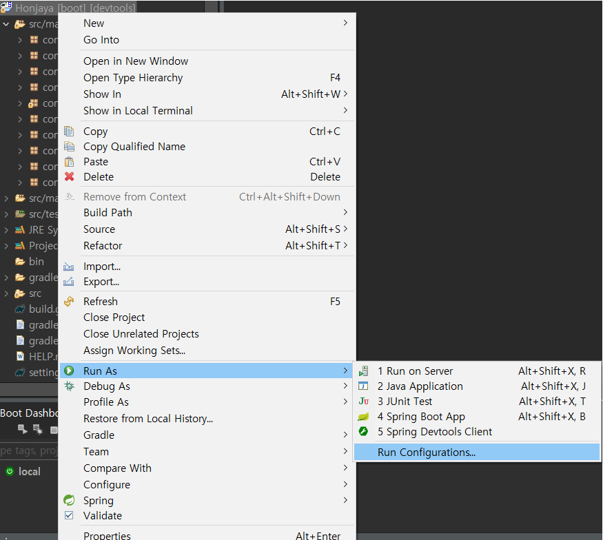
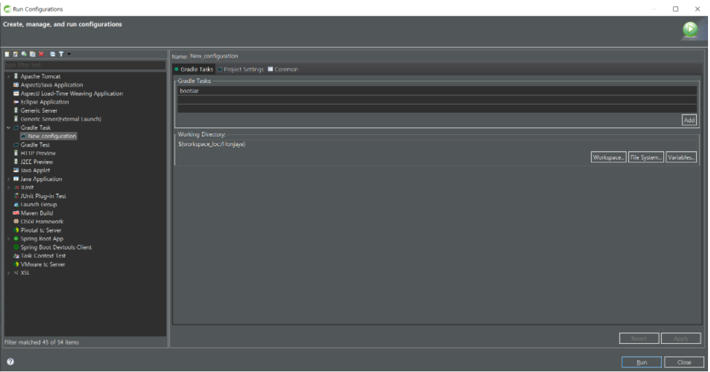
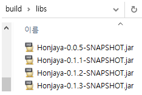

# 백엔드 배포

### 1. STS 툴에서 Run AS >  Run Configurations...




### 2. Gradle Task > New_configuration 을 클릭한 후 Gradle Tasks에 bootJar를 Add하고 Run을 누르면 build 됨

\

- workspace 폴더/프로젝트 폴더/build/libs 폴더로 이동하면 Jar파일이 생성되어 있다.




### 3. NGINX 설정

- nginx 설치 명령어

```bash
sudo apt update
# Nginx 설치
sudo apt install nginx
# 설치된 Nginx 버전확인
sudo nginx -v
```

- nginx 설정

```bash
cd /etc/nginx/site-available/

파일수정명령어 default
ex) nano default
```

```bash
server {
        listen 80 default_server;
        listen [::]:80 default_server;

        # SSL configuration
        # https포트(443) 사용하기
        listen 443 ssl default_server;
        listen [::]:443 ssl default_server;
        #
        # Note: You should disable gzip for SSL traffic.
        # See: https://bugs.debian.org/773332
        #
        # Read up on ssl_ciphers to ensure a secure configuration.
        # See: https://bugs.debian.org/765782
        #
        # Self signed certs generated by the ssl-cert package
        # Don't use them in a production server!
        #
        # include snippets/snakeoil.conf;

				#프론트 빌드 파일을 가져올 경로
        root /var/www/html/build;

        # Add index.php to the list if you are using PHP
				# 경로에 존재하는 보여줄 프론트 페이지 파일 이름
        index index.html;
				
				#도메인 이름
        server_name my.domain.url.com;
				#https 보안 포트 접속에 사용할 인증서 위치
				#certbot nginx설정 포함 인증서 발급시 자동으로 기입되지만
				#나는 이때 5회 발급초과여서 zerossl이라는 또다른 무료 인증서 발급사이트를 사용함
        ssl_certificate /home/ubuntu/zerossl/certificate.crt;
        ssl_certificate_key /home/ubuntu/zerossl/private.key;

				#해당 도메인(location) 뒤에 올 경로에 따라 분기
        location / {
                # First attempt to serve request as file, then
                # as directory, then fall back to displaying a 404.
                try_files $uri $uri/ /index.html;
        }
				#백엔드 경로
        location /honjaya {
                proxy_pass http://localhost:8080;
                proxy_redirect off;
								#stomp채팅 관련되서 sockJS의 버전이 맞지않아 http 버전을 재설정함
                proxy_http_version 1.1;
                charset utf-8;

                proxy_set_header X-Readl-IP $remote_addr;
                proxy_set_header X-Forwarded-for @proxy_add_x_forwarded_for;
                proxy_set_header X-Forwarded-Proto $scheme;
                proxy_set_header X-NginX-Proxy true;
								#sockJS에 의한 오류 해결을 위한 추가 해더
                proxy_set_header Upgrade $http_upgrade;
                proxy_set_header Connection "upgrade";
        }

        # pass PHP scripts to FastCGI server
        #
        #location ~ \.php$ {
        #       include snippets/fastcgi-php.conf;
        #
        #       # With php-fpm (or other unix sockets):
        #       fastcgi_pass unix:/var/run/php/php7.4-fpm.sock;
        #       # With php-cgi (or other tcp sockets):
        #       fastcgi_pass 127.0.0.1:9000;
        #}

        # deny access to .htaccess files, if Apache's document root
        # concurs with nginx's one
        #
        #location ~ /\.ht {
        #       deny all;
        #}
}
```

- 위와 같이 설정이 되면 저장하고 나온 후 nginx를 restart 시키면 됨

```bash
sudo service nginx restart
```


### 4. 빌드된 Jar 파일을 EC2 서버의 실행시킬 위치로 드래그하여 이동 후 명령어 실행

```bash
java -jar Honjaya*.jar
```

```bash
nohup java -jar Honjaya*.jar
```

> 백그라운드에서 실행할 수 있는 명령어.
>
> 아래의 명령어를 실행한 후 EC2 GUI 창을 닫아도 Jar는 실행되고 있다.

```bash
ps -ef | grep Honjaya
```

> 백그라운드로 실행되고 있는 프로그램을 종료하고 싶을 시, 먼저 아래의 명령어를 쳐서 해당 이름으로 실행되고 있는 프로그램의 pid 번호를 알아낸다. 가장 왼쪽에 이름이 있고, 그 오른쪽에 뜨는 번호가 pid 번호다.

```bash
kill -9 000000
```

> 해당 pid 번호를 통해 프로그램을 종료시킨다. (kill -9 {pid})


---

- 배포 시 특이사항: MySQL 계정 / 암호 + SMTP 구글 이메일 전송용 계정 / 암호는 명시하지 않았습니다. 필요할 시에 팀원에게 연락을 해주시고, 연락이 어려울 시, DB 덤프 파일을 함께 제출하므로 직접 생성 후 사용하셔도 됩니다.