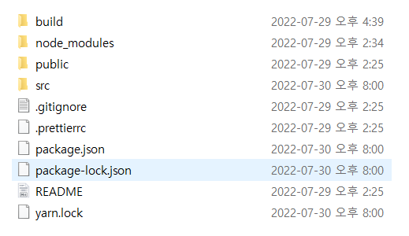
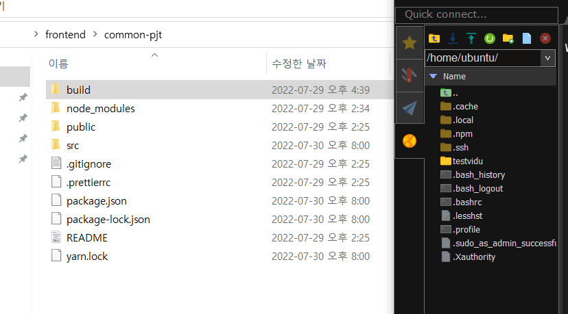
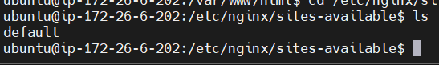
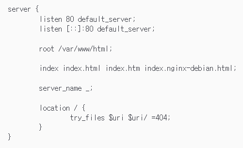
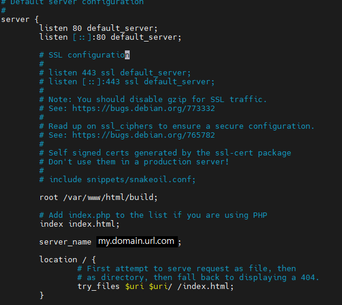
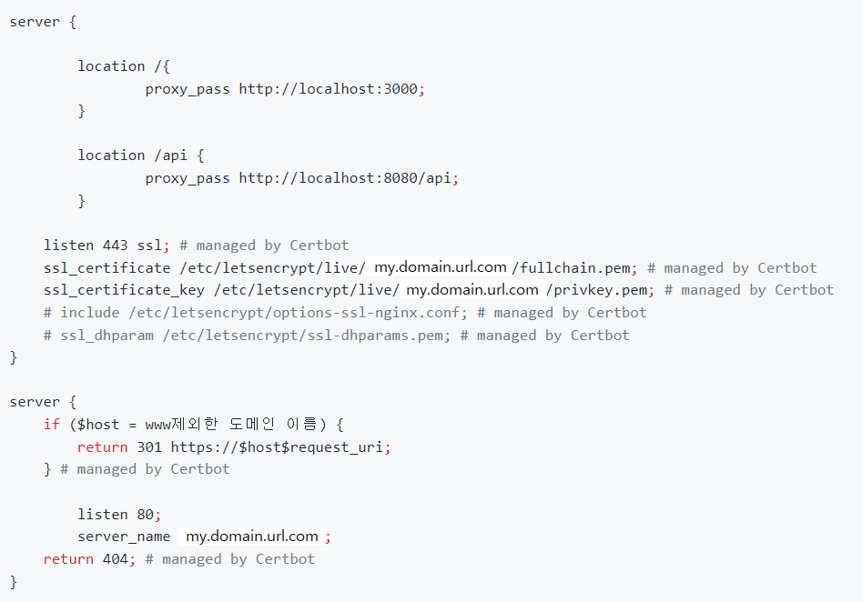

# [FE] nginx 수동 배포 (프로젝트 진행 당시)

## 1단계 : 빌드 및 ec2에 넣기

### 빌드

- 빌드 자체는 간단하다.
  프론트 프로젝트에서 yarn build 명령어를 실행하면 build된 파일이 나타난다.

  


- 해당 build 파일을 ec2서버에 nginx가 배포하기로 한 위치에 이동해야 한다.


### ec2 서버에 빌드 파일 넣기

> 실제로는 아마 ec2서버에 프론트를 git pull해서 내부에서 빌드해야 하는 것 같다. (추측)
- 만들어진 빌드 폴더를 mobaXterm에 넣어주자
  킹갓 제네럴 엠페러 mobaXterm은 gui가 있기 때문에 업로드는 폴더를 끌어서 gui 목록에 넣어주면 된다.

- `주의사항`
    - nginx가 배포하는 위치로 바로 폴더를 gui로 이동시키려면 실패한다
    
    - 그 이유는 nginx로 파일을 이동시킬 권한이 없기 때문이다.
    
    - 그러므로 /home/ubuntu/ 위치에 먼저 끌어서 넣은 뒤

      cli 상으로 이동시켜야 한다.
    
    - 
    
- /home/ubuntu/에 끌어서 옮겼다면, 이제 nginx가 배포하는 위치로 옮겨야한다.


## nginx 설정

- nginx 설치
  
    > 실제 nginx 홈페이지에는 무슨 여러 설정이 필요하다고 나와있는데 잘 모르겠다. 그냥 설치했는데 됐다.
    > 
    
    ```bash
    sudo apt-get update #관례적
    sudo apt-get install nginx
    sudo service nginx status
    ```
    
- 만약 nginx가 실행이 안되었다면,
  sudo service nginx start를 하면 된다.
  
    - nginx의 구동이 안될 경우, 에러에서 80포트를 이미 사용중이라고 할 때가 있다.
    - 해당 에러는 잠시 nginx를 멈춘 사이 apache2가 80포트를 차지해서 그렇다 카던데 정확하게는 모르겠다.
    - 80포트를 닫거나(죽이거) 하면 해결 될 것이고, 그 상태로 nginx를 다시 시작해보자.
    - 포트 상태 확인은 netstat -tnlp로 확인 가능하며, 
      netstat는 깔려있는데 이상하게 깔아야만 했다.
    - 포트 죽이기는 fuser -k portnum/tcp
    - 근데 여러번 했는데 작동이 잘 안된 적도 있다.
      안먹힌다면, fuser -n tcp -k portnum 또는 kill -p portnum을 시도해보자
- 기본적으로 nginx는 /var/www/html/폴더 안의 index.html 파일들을 배포한다.
- /home/ubuntu/build 파일을 옮겨주자
  
    ```bash
    sudo mv /home/ubuntu/build /var/www/html/
    ```
    
    파일 옮겨도 gui에서 변동이 없는건 새로고침이 안되서 그런것이다.
    
    
    
- 옮겨가면 원래 index.nginx-debian.html 이라는 파일이 있다.
    - 해당 파일은 nginx에서 기본적으로 쓰는 welcome 파일이다.
    
    

### nginx 설정 건드리기

- nginx는 기본적으로 /etc에 설치되어있다.
- nginx의 사이트 설정은
/etc/nginx/site-available/ 폴더에 default 파일을 켜서 설정 해 주어야 한다.
- 

```bash
#해당 위치라면
sudo vim default
#다른 위치라면
sudo vim /etc/nginx/sites-available/default
```

- default 파일을 열면 아래 이미지처럼 나올 것이다.



- 정확하게는 모르지만, 대충 80포트로 들어오는 걸 듣고 있다는 뜻인 것 같다.
- 배포하려는 파일의 위치는 root로 표기되어있다.
우리가 build된 파일의 위치를 넣어주면 된다.
- 해당 root의 위치에서 어떤 페이지를 열 것인가 하는 건
index 라는 것으로 표현되어있는데, 보면 index.nginx-debian.html를 찾을 수 있다.
- SPA에서 라우팅된 주소로 가려면 location을 건드려야 하는 것 같다.
    - `location /` 는 추가 주소? 같은 위치에 /가 들어오면 해당 파일로 보내주는 느낌이다.
    - try_files는 적혀진 순서대로 파일들을 찾고 표출하겠다는 설정이라고 한다.
- 22.07.30 현재 설정된 형태는 아래 이미지와 같다.



- nginx의 설정을 변경했다면, 무조건 nginx를 재시작해주어야 설정파일이 적용된다.
- 참고로 설정 수정은 i를 통해 수정가능하며, 수정모드를 나가려면 esc
저장하려면 :wq 저장하지않고 나가려면 :q

```bash
sudo service nginx restart
```


# 현재상태

> [https://certbot.eff.org/instructions?ws=nginx&os=ubuntufocal](https://certbot.eff.org/instructions?ws=nginx&os=ubuntufocal)
certbot 공식 사이트로 따라하면서 인증서 발급 해볼 예정
> 
- 인증서 발급이 안되어서 그런지, 프론트서버를 로컬에서 켜서 미팅을 들어갔을때는 영상이 나타났는데, 현재 ec2에 올려서 배포한 다음 접속하니 영상이 나타나질 않는다.
- 아마 인증서를 받지 않아서 그런게 아닐까 추측중이다.
- certbot을 통한 인증서를 받았는데, 현재 사용중인 openvidu 서버가 튜토리얼꺼라 openvidu 환경설정이 selfsigned로 되어있어서 안되는 것 같다.
- 튜토리얼 서버 도커를 삭제하고, openvidu 환경변수 중 CERTIFICATED_TYPE=letsencrypt 값과 LETSENCRYPT_EMAIL=asdf1234@naver.com 이라는 값을 넣어주면서 도커에 서버를 실행하였음에도 불구하고 작동이 안되는 것 같다.
- 뭔가 http에서 https로 적용시키는게 잘 안된 것 같다.
http로 my.domain.url.com/login 은 잘 들어가졌으나 현재 https가 되니 접속이 안된다.
- 또한 http로 접속하면 nginx가 자동으로 https로 바꿔주기 때문에 http 상에서 나타나는지도 확인이 불가능해졌다.
- 현재 meeting의 영상을 제외한 모든 페이지가 https로 잘 들어가진다.

- `location, proxy_pass 등에 관하여`
  
    아래 이미지는 homedong의 nginx 설정인데 정확하게 location과 index, server_name 등 뭐가 어떻게 돌아가는지는 현재 파악하지 못하였고, 추후 코치님에게 질문한 답변을 받아야 할 것 같다.
    
    