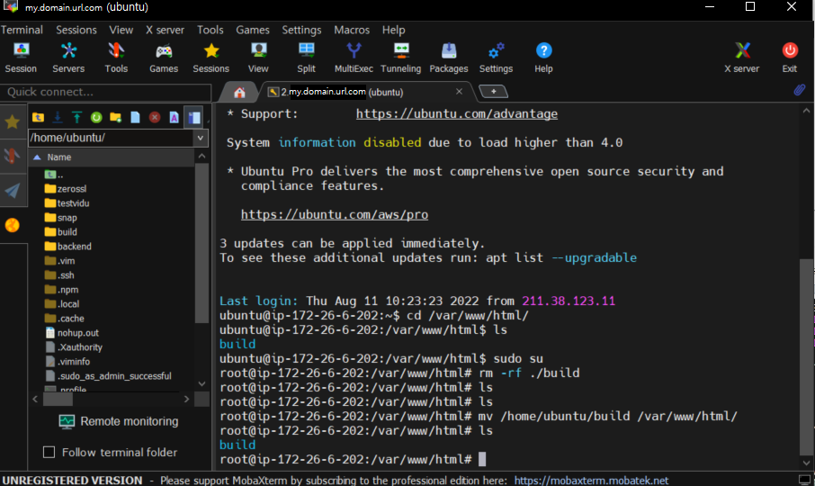
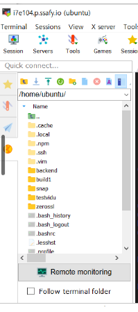

# [FE] 빌드 후 배포

### 1. VSC에서 yarn build

### 2. 내가 vsc코드로 열기 한 폴더에 build 생김

### 3. 모바엑스텀 키고 기존 빌드 폴더 삭제 명령어 수행후

### 4. 직접 빌드 폴더 해당 위치로 드래그해서 임베드 시키고



### 5. 빌드 폴더 위치만 현재 경로로 바꾸어 주면됨

### 명령어 리스트



```tsx
sudo su
cd /var/www/html/
rm -rf ./build
ls
mv /home/ubuntu/build /var/www/html/
ls
```